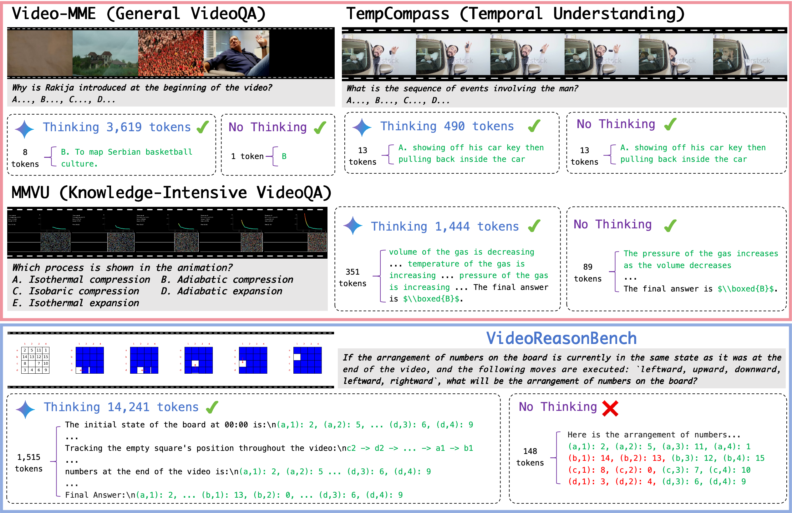
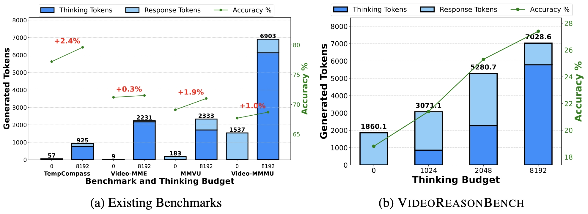
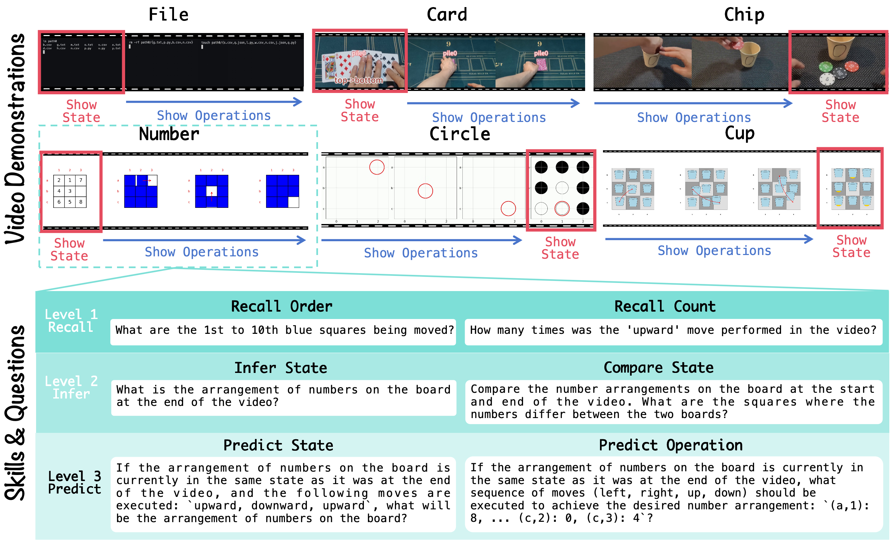
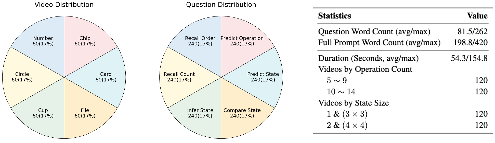
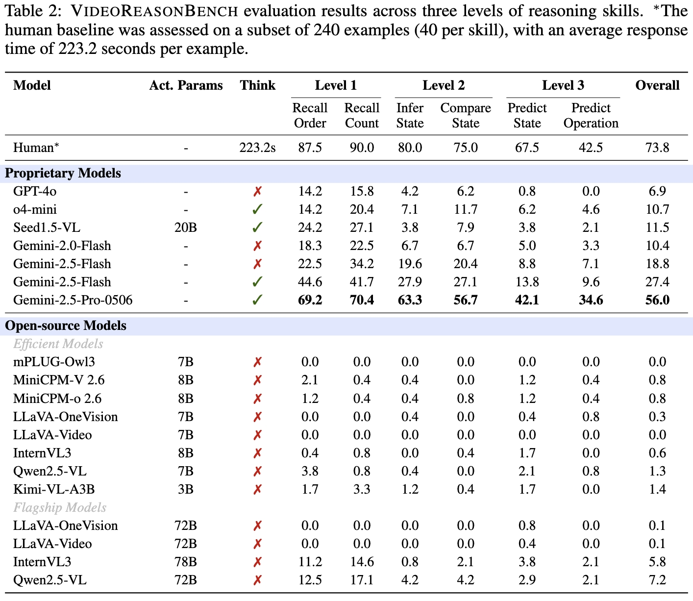
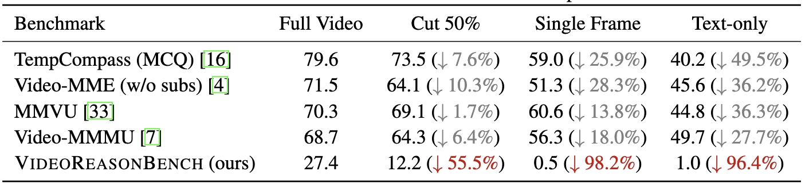

<p align="center">
  <h1 style="display: inline;">
    
    VideoReasonBench: Can MLLMs Perform Vision-Centric Complex Video Reasoning?
  </h1>
</p>

<p align="center">
  <a href="https://llyx97.github.io/video_reason_bench/"></a>
  <a href="https://arxiv.org/pdf/2505.23359"></a>
  <a href="https://huggingface.co/datasets/lyx97/reasoning_videos"></a>
</p>


## ✨ Highlights
<!-- <figure>
  
  <figcaption>Examples from VideoReasonBench and three existing VideoQA benchmarks. Responses are generated by Gemini-2.5-Flash in both ``Thinking'' and ``No Thinking'' modes.</figcaption>
</figure>
<figure>
  
  <figcaption>Performance of Gemini-2.5-Flash with varying thinking budgets on five benchmarks.</figcaption>
</figure> -->


|:--:|
| Examples from VideoReasonBench and three existing VideoQA benchmarks. Responses are generated by Gemini-2.5-Flash in both "Thinking" and "No Thinking" modes. |


|:--:|
| Performance of Gemini-2.5-Flash with varying thinking budgets on five benchmarks. |

**Complex Reasoning**
- Gemini-2.5-Flash achieves over 65% accuracy on standard benchmarks but drops to just 27.4% on VideoReasonBench.
- On average, it consumes over 7,000 tokens to arrive at an answer.

**Thinking-Reliant**
- VideoReasonBench performance shows stronger correlation with the thinking budget, compared with existing benchmarks.

**Vision-Centric Reasoning**
- The reasoning process is deeply grounded in the video content.


## 👉 Overview


### Videos
Each video features a latent state and a sequence of operations. The latent state is revealed either at the beginning or the end of the video. Throughout the rest of the video, the latent state remains invisible while the operations drive state transitions. There are six types of video demonstrations:
- **Number**: Sliding number puzzle.
- **Circle**: A red circle moving on grid, flipping the color of black and white pieces.
- **Cup**: Swapping cups and the content beneath.
- **File**: Creating, deleting, copying, and moving files within/between paths.
- **Card**: Adding or removing cards to/from piles.
- **Chip**: Adding or removing chips to/from cups.

### Questions
The questions assess video reasoning skills across three levels:
- **Level 1 (Recall)**: Precisely recalling the sequential visual observations from the video.
- **Level 2 (Infer)**: Infer latent information that is not directly observable from the video.
- **Level 3 (Predict)**: Predict new information beyond the video.

## 🚀 Quick Start

### Direct Evaluation

#### Step 1: Setup

**Installation**
```
pip install google-genai==1.12.0
pip install openai==1.64.0
pip install transformers
```

**Setup Keys**

Set the environment variables `GEMINI_API_KEY`, `OPENAI_API_KEY` and `OPENAI_API_BASE`.

#### Step 2: Download Videos
```
wget https://huggingface.co/datasets/lyx97/reasoning_videos/resolve/main/videos.zip
unzip videos.zip
```

#### Step 3: Evaluation
```
bash eval_gemini.sh        # evaluate gemini series models
bash eval_openai.sh        # evaluate openai models
bash eval_qwen.sh          # evaluate qwen2.5-vl models
```

An example of evaluation result can be found [here](https://github.com/llyx97/video_reason_bench/blob/main/predictions/example_direct_eval.json).

### Evaluation using VLMEvalKit

#### Step 1: Setup

**Installation**
```
cd vlmevalkit
pip install -e .
```

**Setup Keys**

Place the required keys in `vlmevalkit/.env` or directly set them as the environment variable.


#### Step 2: Configuration
Setup the model and dataset configuration in `vlmevalkit/configs/{your_config}.json`. For example:
```python
{
    "model": {
        "Qwen2.5-VL-72B-Instruct": {
            "class": "Qwen2VLChat",
            "model_path": "Qwen/Qwen2.5-VL-72B-Instruct",
            "min_pixels": 50176,
            "max_pixels": 200704,
            "max_new_tokens": 4096
        }
    },
    "data": {
        "VideoReasoningBench_64frame": {
            "class": "VideoReasoningBench",
            "dataset": "VideoReasoningBench",
            "nframe": 64
        }
    }
}
```

#### Step 3: Evaluation
```bash
torchrun --nproc-per-node=8 run.py --judge gpt-4o-1120 --config configs/video_reasoning_bench_qwen2.5-vl-7b.json --reuse        # 7B-scale model
AUTO_SPLIT=1 torchrun --nproc-per-node=1 run.py --judge gpt-4o-1120 --config configs/video_reasoning_bench_qwen2.5-vl-72b.json  # 72B-scale model
```

An example of evaluation result can be found [here](https://github.com/llyx97/video_reason_bench/blob/main/predictions/example_vlmevalkit.xlsx).

## 📊 Evaluation Results
### Main Results
- Current MLLMs struggle with vision-centric complex video reasoning.
- VideoReasonBench poses substantial challenges—even for humans.
- Thinking is critical for performance on VideoReasonBench.
- Reasoning difficulty increases from Level 1 to Level 3.


### Results of Gemini-2.5-Flash with different visual inputs
- VideoReasonBench demands a higher degree of vision reliance (**vision-centric**) than current video understanding benchmarks.
